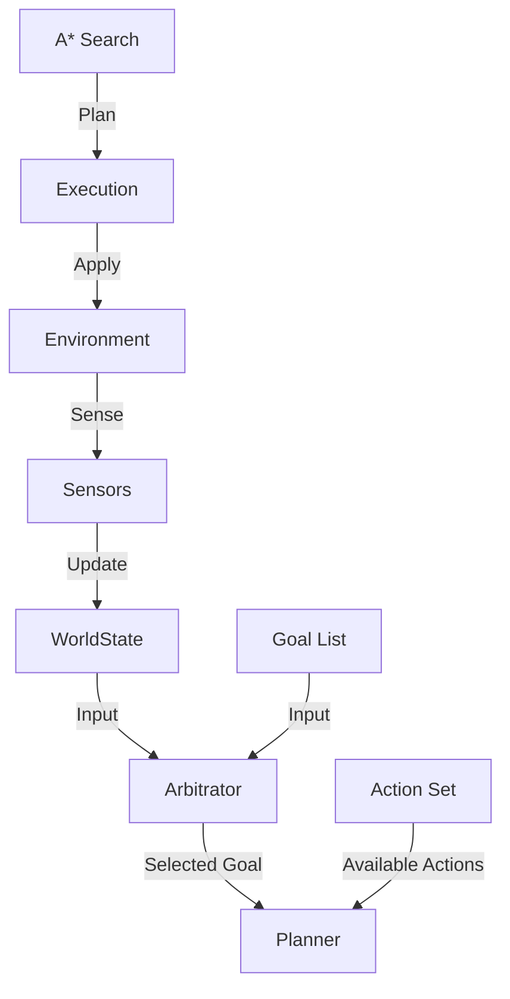

# Core Concepts & Architecture

`goapauto` implements a standard Goal-Oriented Action Planning architecture modularized for Python.

## System Components

### 1. World Model (`WorldState`)
- **Responsibility**: Stores the current state of the environment and agent.
- **Design**: Pydantic model with dynamic attribute access (`state.key` or `state['key']`).
- **Mutability**: Methods like `update()` mutate the instance; `copy()` and `apply()` create new instances.

### 2. Action System
- **Action**: Atomic unit containing:
    - `preconditions`: Predicates (`Equal`, `GreaterThan`) that must match the world state.
    - `effects`: Transformations (`Set`, `Increment`) applied to the state.
    - `cost`: Floating point cost for A* pathfinding.
- **Planner**: Uses A* search to find the lowest-cost sequence of actions connecting `Start State` -> `Goal State`.

### 3. Perception & Arbitration (The "Brain" Loop)
For continuous agents, the system operates in a loop:

1.  **Sense**: `SensorManager` aggregates data from `Sensor`s to update `WorldState`.
2.  **Think (Arbitrate)**: `GoalArbitrator` evaluates all `Goal`s and selects the highest-priority one that is not yet satisfied.
3.  **Plan**: `Planner` generates a specific plan to satisfy the selected `Goal`.
4.  **Act**: The agent executes the plan (actions).

## Data Flow Diagram

## Design Decisions
- **Loose Coupling**: Sensors and Arbitrators are optional. You can use the `Planner` purely as a pathfinding utility.
- **Strict Typing**: All core models enforce types to catch configuration errors early.
- **Observability**: Hooks and Visualization allow introspection into the planning process (White-box AI).
