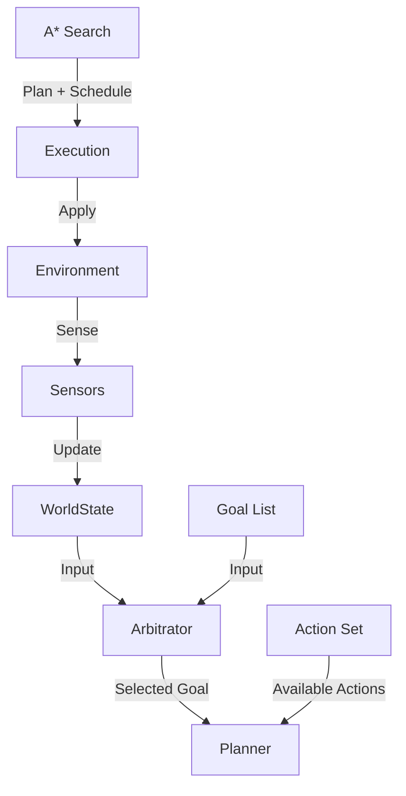

# Core Concepts & Architecture

`goapauto` implements a standard Goal-Oriented Action Planning architecture modularized for Python.

## System Components

### 1. World Model (`WorldState`)

- **Responsibility**: Stores the current state of the environment and agent.
- **Design**: Pydantic model with dynamic attribute access (`state.key` or `state['key']`).
- **Mutability**: Methods like `update()` mutate the instance; `copy()` and `apply()` create new instances.
- **Three-valued logic**: Distinguishes "unknown" (never set) from "explicitly False/None" via `_UNKNOWN` sentinel and `is_known()` method.

### 2. Action System

- **Action**: Atomic unit containing:
    - `preconditions`: Predicates (`Equal`, `GreaterThan`, `LessThan`, `Range`, callables) that must match the world state.
    - `effects`: Transformations (`Set`, `Increment`, `Decrement`, `Unset`/`Delete`) applied to the state.
    - `cost`: Scalar float or multi-dimensional dict/list for optimization.
    - `duration`: Optional float for temporal planning (seconds).
- **Planner**: Uses A\* search to find the lowest-cost sequence of actions connecting `Start State` -> `Goal State`.
- **Cost optimization**: `Planner(cost_weights=...)` supports weighted multi-dimensional costs.
- **Temporal planning**: Actions with `duration` generate a `Schedule` with start/end times and makespan.

### 3. Perception & Arbitration (The "Brain" Loop)

For continuous agents, the system operates in a loop:

1. **Sense**: `SensorManager` aggregates data from `Sensor`s to update `WorldState`.
1. **Think (Arbitrate)**: `GoalArbitrator` evaluates all `Goal`s and selects the highest-priority one that is not yet satisfied.
1. **Plan**: `Planner` generates a specific plan to satisfy the selected `Goal`.
1. **Act**: The agent executes the plan (actions).

### 4. Goal System

- **Goal**: Target state with priority and optional name.
- **Target values**: Support exact matches, predicates (`GreaterThan`, `LessThan`, `Range`), and callables (lambdas).
- **Priority**: Lower number = higher priority.
- **Context-aware actions**: Action providers receive the current goal to generate context-aware actions.

### 5. Planning & Search

- **Algorithm**: A\* search with configurable heuristic (`Node.heuristic` or `Node.numeric_heuristic`).
- **Depth limiting**: `max_depth` parameter to limit search depth.
- **Hooks**: `on_node_expanded`, `on_plan_found`, `on_search_failed` for observability.
- **Search graph**: `Planner.get_search_graph()` exposes nodes, edges, and metadata for visualization/analysis.
- **Incremental replanning**: `continue_plan()` resumes from a checkpoint with already-executed actions.

### 6. Temporal & Multi-dimensional Planning

- **Duration**: Actions can have `duration` for temporal planning; planner builds sequential `Schedule`.
- **Multi-dimensional costs**: Action costs can be dict/list; `cost_weights` in Planner defines optimization weights.
- **Numeric heuristic**: `Node.numeric_heuristic` provides distance-based heuristic for numeric goals.
- **Schedules**: `PlanResult.schedule` contains `ScheduleStep` with start/end times, duration, and makespan.

### 7. State Representation

- **Three-valued logic**: `WorldState` distinguishes "unknown" (never set, returns `_UNKNOWN`) from explicit `False`/`None` via `is_known()`.
- **Effect types**: `Set`, `Increment`, `Decrement`, `Unset`/`Delete` applied via `update_state()`.
- **Immutability**: `apply()` and `copy()` create new states; `update()` mutates in place.

## Data Flow Diagram

```mermaid
graph TD
    Env[Environment] -->|Sense| Sensors
    Sensors -->|Update| State[WorldState]
    State -->|Input| Arbitrator
    Goals[Goal List] -->|Input| Arbitrator
    Arbitrator -->|Selected Goal| Planner
    Actions[Action Set] -->|Available Actions| Planner
    Planning[A* Search] -->|Plan + Schedule| Execution
    Execution -->|Apply| Env
```

## Design Decisions

- **Loose Coupling**: Sensors and Arbitrators are optional. You can use the `Planner` purely as a pathfinding utility.
- **Strict Typing**: All core models enforce types to catch configuration errors early.
- **Observability**: Hooks, Visualization, and Search Graph allow introspection into the planning process (White-box AI).
- **Flexible Cost Model**: Supports scalar, dict, and list costs with configurable weights.
- **Temporal Awareness**: Optional duration and schedule generation for real-time systems.
